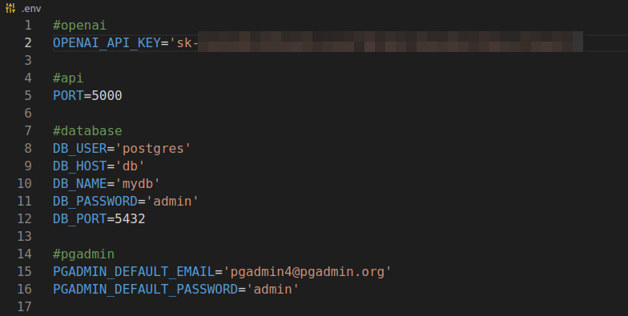
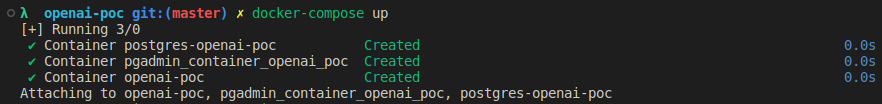
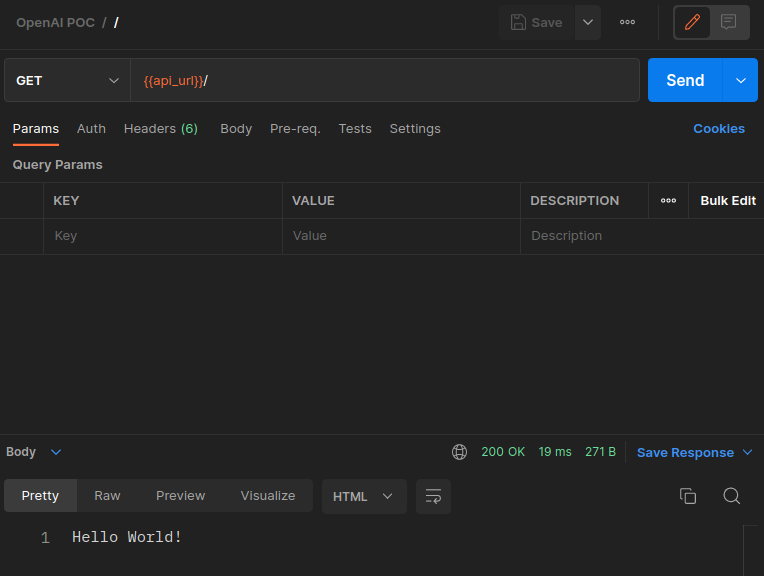

# OpenAI POC

### API
The goal of this API is to have a chat bot that can be "trained" on custom content, and answer questions about the content. For instance, using this API you can upload a PDF and then query it on its contents.

## Setup

Clone this repo, then go to the API folder and create a `.env` file from `.env.example.`
Add your OpenAI API key

Run `npm install`

Then start docker by running:

`docker-compose up`

The API runs on `localhost:5000`

There is a collection in this repo, you can use it to consume the API endpoints.

## Migrations
The database migrations should run automatically when starting Docker.

* You can run manualy with this command `npm run migrate up` inside the Docker container
* Run `npm run migrate create migration name` to create a new migration file.

## pgAdmin
pgAdmin is included, you can access it via: `http://localhost:8080/`

The user credentials are provided on the `.env` file.